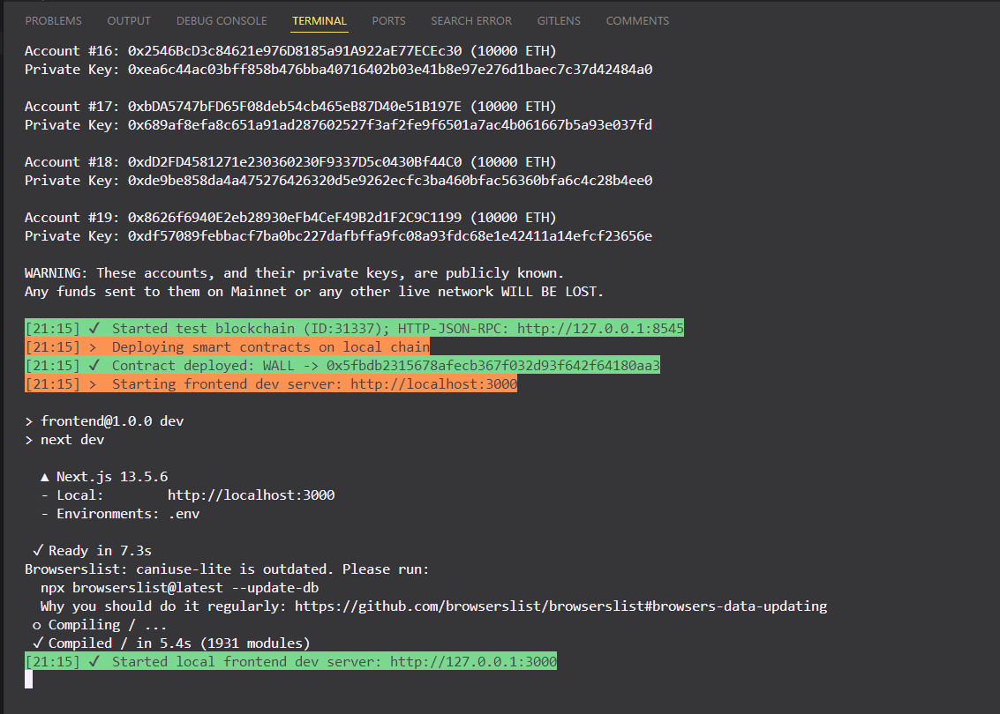
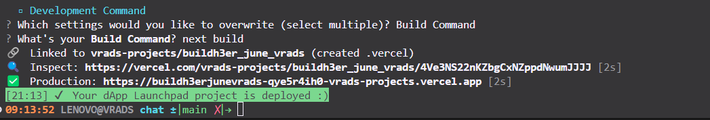
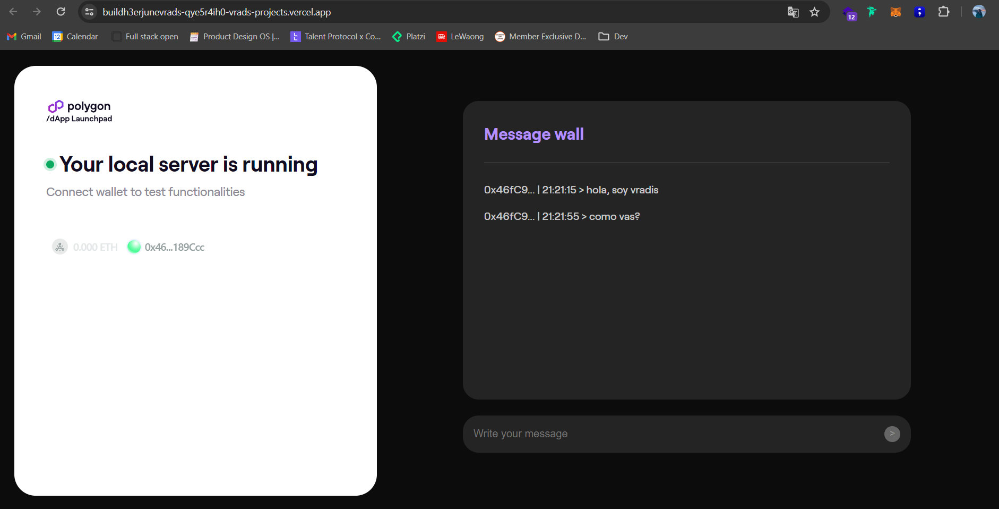
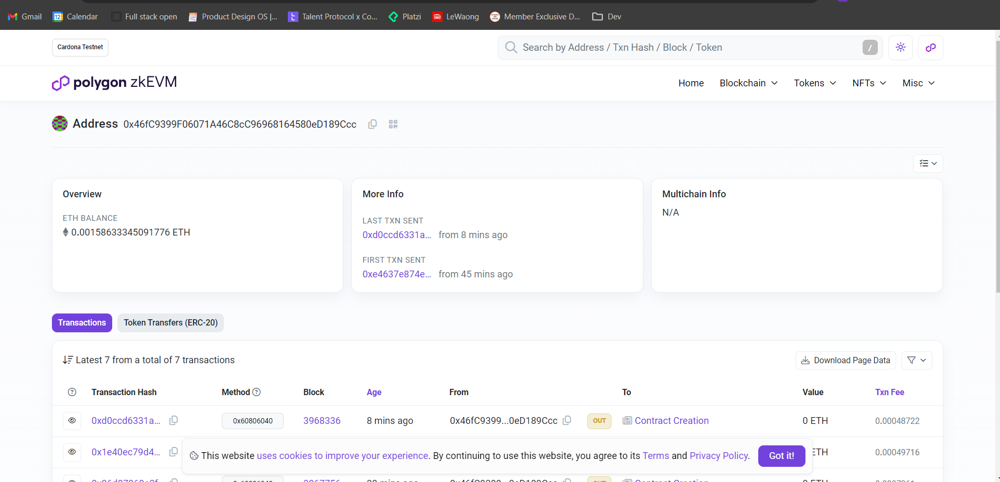
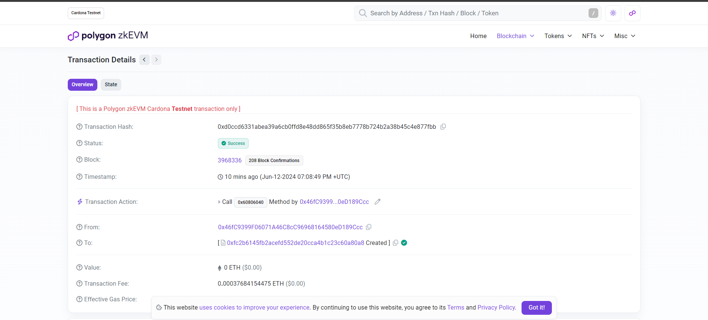

# Building Full-Stack Applications on Polygon zkEVM

>Challengue : Deploy a dApp on Polygon zkEVM.

### **Proof**

1. Deploy contract

2. Deploy app

 - Link to vercel : **https://buildh3erjunevrads-qye5r4ih0-vrads-projects.vercel.app/**

 

 3. Deploy with wallet

  
 