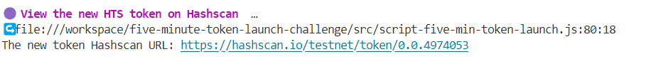
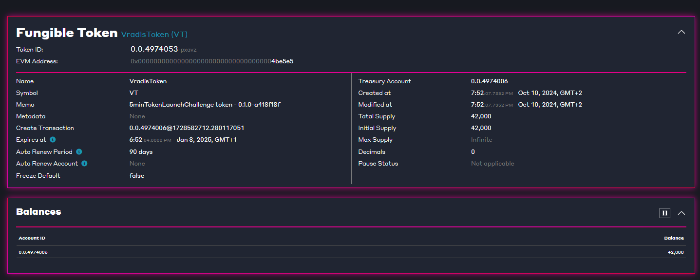
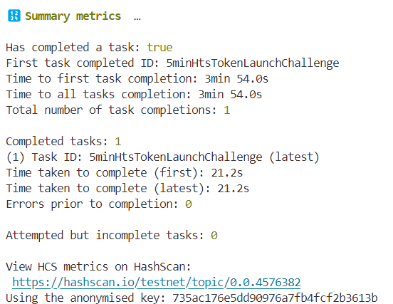
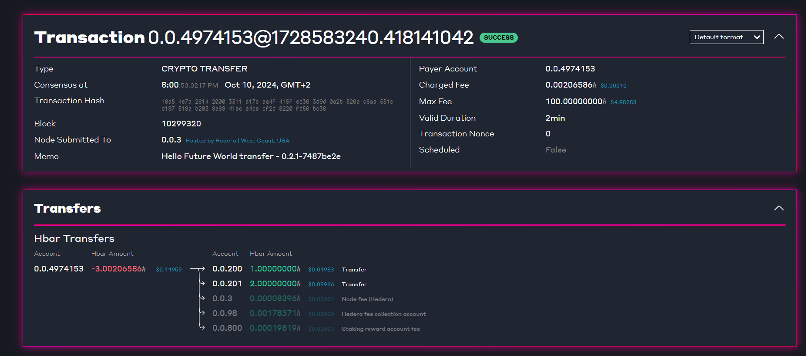
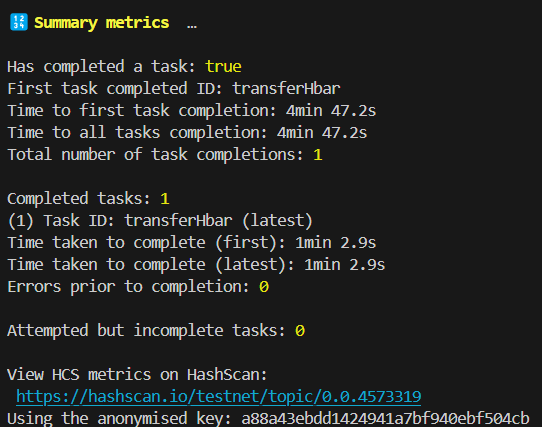
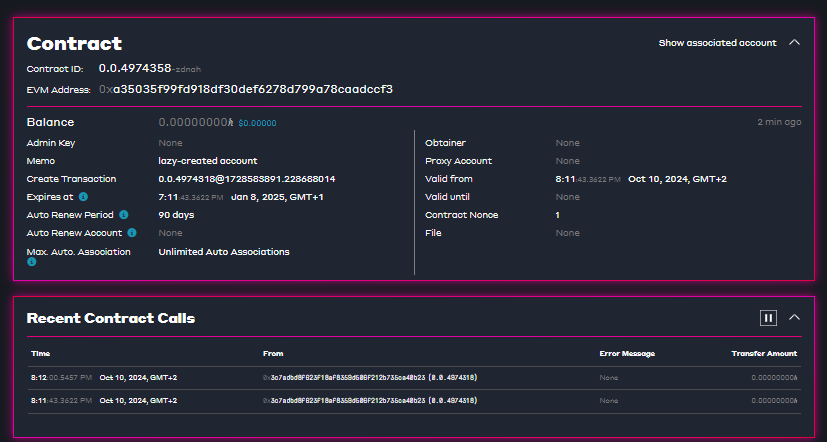
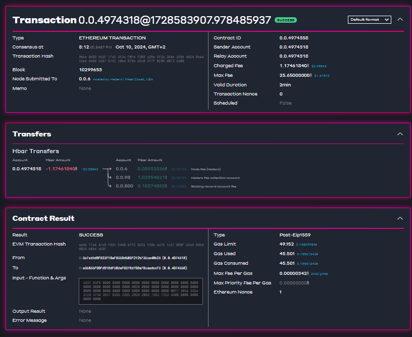
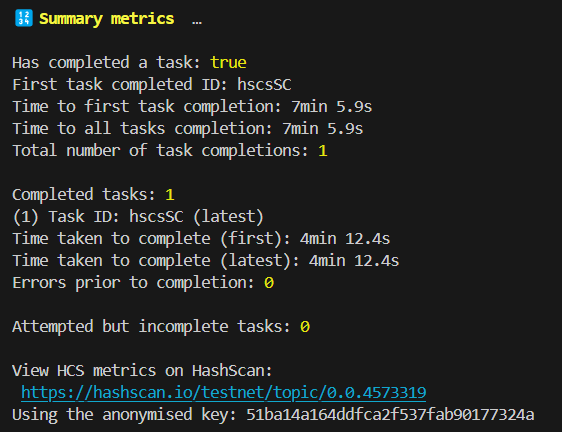

# Hedera_Workshops_Tasks

## 1. Five Minute Hedera Token Service Launch Challenge

   **URL**: https://hashscan.io/testnet/token/0.0.4974053

   
   


<details>

<summary>🔢 Summary metrics </summary>

Has completed a task: true

First task completed ID: 5minHtsTokenLaunchChallenge

Time to first task completion: 3min 54.0s

Time to all tasks completion: 3min 54.0s

Total number of task completions: 1

Completed tasks: 1

(1) Task ID: 5minHtsTokenLaunchChallenge (latest)

Time taken to complete (first): 21.2s

Time taken to complete (latest): 21.2s

Errors prior to completion: 0

Attempted but incomplete tasks: 0

View HCS metrics on HashScan:
 https://hashscan.io/testnet/topic/0.0.4576382 
Using the anonymised key: 735ac176e5dd90976a7fb4fcf2b3613b

</details>
<br>




## 2. Hello World - HCS: Topic

 **URL**: https://hashscan.io/testnet/transaction/0.0.4974153@1728583240.418141042

   

<details>
 
<summary>🔢 Summary metrics </summary>

```Has completed a task: true```

```First task completed ID: transferHbar```

```Time to first task completion: 4min 47.2s```

```Time to all tasks completion: 4min 47.2s```

```Total number of task completions: 1```


```-Completed tasks: 1```

```-(1) Task ID: transferHbar (latest)```

```-Time taken to complete (first): 1min 2.9s```

```-Time taken to complete (latest): 1min 2.9s```

```-Errors prior to completion: 0```

```-Attempted but incomplete tasks: 0```

```-View HCS metrics on HashScan:```

``` -https://hashscan.io/testnet/topic/0.0.4573319 ```

```-Using the anonymised key: a88a43ebdd1424941a7bf940ebf504cb```
</details>




## 3. Hello World - HSCS: Smart Contracts

🟣 Deploying smart contract  …

Smart contract deployment Hashscan URL:

 **URL**: https://hashscan.io/testnet/contract/0xA35035F99FD918df30DEF6278D799A78CAaDCCf3

 


🟣 Write data to smart contract  …
Smart contract write transaction hash 

```0xaada17a447c8f8d1644047f2922af39eacf61c57068f52ad8dbd8024b0bda59f```

**Smart contract write transaction Hashscan URL:**
 https://hashscan.io/testnet/transaction/0xaada17a447c8f8d1644047f2922af39eacf61c57068f52ad8dbd8024b0bda59f


 


<details>

<summary>🔢 Summary metrics </summary>

```Has completed a task: true```

```First task completed ID: hscsSC```

```Time to first task completion: 7min 5.9s```

```Time to all tasks completion: 7min 5.9s```

```Total number of task completions: 1```


```Completed tasks: 1```

```(1) Task ID: hscsSC (latest)```

```Time taken to complete (first): 4min 12.4s```

```Time taken to complete (latest): 4min 12.4s```

```Errors prior to completion: 0```

```Attempted but incomplete tasks: 0```

```View HCS metrics on HashScan:```

``` https://hashscan.io/testnet/topic/0.0.4573319 ```

```Using the anonymised key: 51ba14a164ddfca2f537fab90177324a```
</details>



