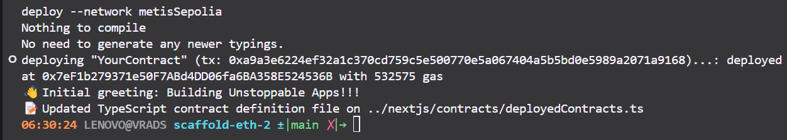
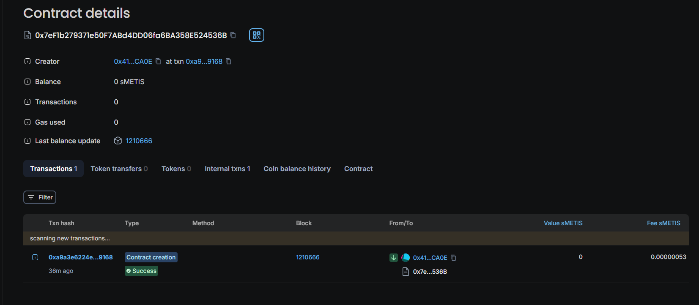

# Metis_Workshops

````My Wallet: 0x41C9133be0a4486bE1f09a8c7E34cE6213F0CA0E````

1. Proof Deploy:


2. Information:

```deploying "YourContract" (tx: 0xa9a3e6224ef32a1c370cd759c5e500770e5a067404a5b5bd0e5989a2071a9168)...: deployed at 0x7eF1b279371e50F7ABd4DD06fa6BA358E524536B with 532575 gas  ```


### Contract details: 0x7eF1b279371e50F7ABd4DD06fa6BA358E524536B

URL: https://sepolia-explorer.metisdevops.link/address/0x7eF1b279371e50F7ABd4DD06fa6BA358E524536B




